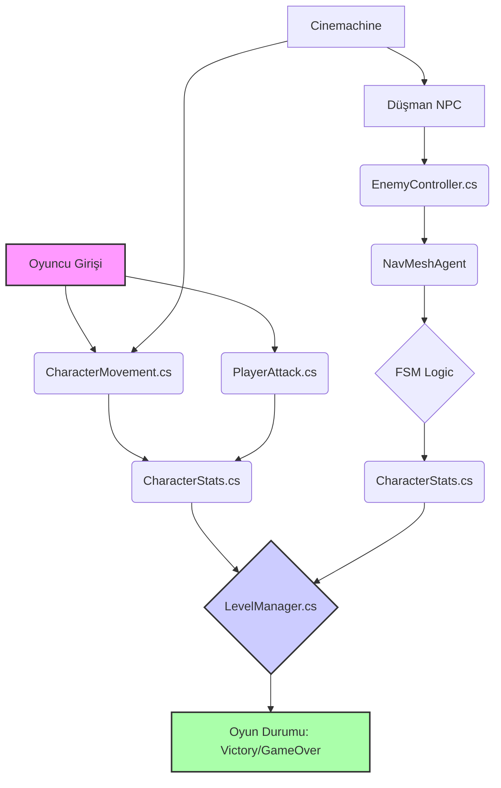
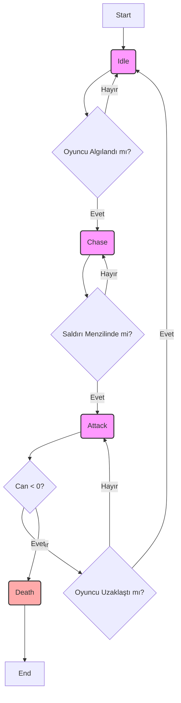

# 📄 2025-2026 Güz Dönemi Yazılım Geliştirme Laboratuvarı I Proje Raporu

## 1. Kapak ve Proje Bilgileri

| Alan | Detay |
| :--- | :--- |
| **Üniversite** | Kocaeli Üniversitesi |
| **Fakülte** | Teknoloji Fakültesi |
| **Bölüm** | Bilişim Sistemleri Mühendisliği |
| **Ders** | Yazılım Geliştirme Laboratuvarı I |
| **Eğitim Yılı / Dönemi** | 2025–2026 Güz Dönemi |
| **Proje Adı** | TPS-AI Project: Yapay Zekâ Destekli Üçüncü Şahıs Nişancı (TPS) Oyunu |
| **Grup No** | 37 |
| **Teslim Tarihi** | 07 Kasım 2025 |

### 1.1. Grup Üyeleri

| Öğrenci No | Ad | Soyad | Katkı Oranı (Tahmini) |
| :--- | :--- | :--- | :--- |
| 241307128 | Hamza | Al Halabi | %33.3 |
| 241307126 | Emad | Alabdulrahman | %33.3 |
| 211307101 | Turan | Asgarli | %33.3 |

---

## 2. Özet (Abstract)

Bu proje, **Unity oyun motoru** kullanılarak geliştirilen, üçüncü şahıs kamera bakış açısına sahip, **yapay zekâ destekli bir aksiyon–RPG oyunudur**. Projenin temel amacı, modern oyun geliştirme süreçlerinde kullanılan temel yapay zekâ ve oyun yönetimi mekaniklerini uygulamalı olarak göstermektir. Oyuncu, karakterini kontrol ederek düşmanlarla savaşır, çevredeki objelerle etkileşim kurar ve sonunda güçlü bir **Boss karakterini yenerek** oyunu tamamlar.

Proje kapsamında, PDF dokümanında belirtilen asgari isterler doğrultusunda, **Finite State Machine (FSM)** tabanlı düşman yapay zekâ sistemi ve **NavMeshAgent** kullanılarak yol bulma (pathfinding) algoritması başarıyla uygulanmıştır. Ayrıca, **Cinemachine** ile dinamik kamera geçişleri, **LevelManager.cs** ile oyun döngüsü ve ses sistemi yönetimi, ve performans optimizasyonu için **Object Pooling** yöntemi kullanılmıştır. Proje, **nesne yönelimli programlama (OOP)** ilkelerine uygun, modüler ve okunabilir bir kod yapısıyla geliştirilmiştir.

---

## 3. Giriş ve Proje Tanımı

### 3.1. Projenin Amacı ve Kapsamı

Bu projenin temel amacı, **Yazılım Geliştirme Laboratuvarı I** dersi kapsamında, **TPS (Third Person Shooter)** türünün temel mekaniklerini karşılayan ve yapay zekâ destekli NPC (Non-Player Character) içeren bir oyun geliştirmektir. Proje, özellikle **FSM (Finite State Machine)** temelli bir yapay zekâ sistemi kullanarak, dinamik davranışlara sahip düşman karakterlerin oyuncu hareketlerine tepki verebildiği bir oyun ortamı oluşturmaya odaklanmıştır.

**Amaçlanan Temel Hedefler:**

1.  **TPS Mekaniklerinin Uygulanması:** Karakter kontrolü, nişan alma, ateş etme ve taktiksel pozisyon alma gibi temel TPS mekaniklerini hayata geçirmek.
2.  **Yapay Zekâ (AI) Uygulaması:** Düşman NPC'ler için **Idle, Patrol, Chase, Attack** durumlarını içeren FSM yapısını kodlamak.
3.  **Yol Bulma (Pathfinding):** Unity'nin **NavMeshAgent** sistemini kullanarak düşmanların sahnede engelleri aşarak oyuncuya ulaşmasını sağlamak.
4.  **Oyun Yönetimi:** Oyun döngüsünü (başlangıç, zafer, kayıp) ve ses/müzik geçişlerini yöneten merkezi bir `LevelManager` sistemi kurmak.
5.  **Akademik Raporlama:** Geliştirilen sistemin şemasını, mekaniklerin blok diyagramını ve literatür taramasını içeren, PDF dokümanında belirtilen formata uygun bir rapor sunmak.

### 3.2. Oyun Türü Seçimi ve Gerekçesi

Proje, **TPS-RPG (Third Person Shooter – Role Playing Game)** türünde bir hibrit yapıdadır. Bu türün seçilmesinin temel gerekçeleri şunlardır:

*   **Görselleştirme Kolaylığı:** FSM tabanlı yapay zekâ davranışları (kovalama, saldırma) TPS bakış açısında oyuncuya ve gözlemciye net bir şekilde yansıtılabilir.
*   **Teknolojik Uygulanabilirlik:** **Cinemachine** ile dinamik kamera yönetimi ve **NavMesh** ile karmaşık yol bulma algoritmalarının uygulanması için ideal bir platform sunar.
*   **Eğitsel Değer:** Yapay zekâ, animasyon, fizik, oyun akışı ve **Nesne Yönelimli Programlama (OOP)** prensiplerini tek bir projede birleştirerek kapsamlı bir öğrenme deneyimi sağlar.

---

## 4. Oyun Senaryosu ve Mekanikleri

### 4.1. Oyun Hikayesi (Senaryo)

Oyun, huzurlu bir köyün, gizemli bir büyü sonucu ortaya çıkan **iskelet ordusu tarafından istila edilmesiyle** başlar. Oyuncu, köyün son savunucusu olan **kahraman bir savaşçıyı** yönetir. Oyuncunun görevi, tüm düşmanları yok ederek bölgeyi temizlemek ve bu istilanın arkasındaki güç olan **ölümsüz Boss karakterini** alt etmektir.

Her düşman ve Boss, oyuncunun eylemlerine dinamik olarak tepki veren, karmaşık bir FSM sistemiyle kontrol edilir. Oyuncu, başarılı olmak için düşmanların davranış kalıplarını çözmek ve taktiksel kararlar almak zorundadır.

### 4.2. Oynanış Mekanikleri

Oynanış, karakter kontrolü ve yapay zekâ tepkisi üzerine kuruludur.

| Eylem | Açıklama | İlgili Script |
| :--- | :--- | :--- |
| **Hareket** | Yürüme (`walkSpeed=5`) ve Koşma (`sprintSpeed=9`) hızlarında karakterin ileri-geri ve yan hareketleri. | `CharacterMovement.cs` |
| **Zıplama** | Tek veya çift zıplama imkanı sunan fizik tabanlı hareket. | `CharacterMovement.cs` |
| **Saldırı** | Fare tıklaması ile tetiklenen, animasyon ve hasar verme mekaniği. | `PlayerAttack.cs`, `PlayerAnimationEvents.cs` |
| **Kamera** | Karakteri dinamik olarak takip eden, sinematik geçişlere sahip `Cinemachine` sanal kamerası. | `CinemachineCamera` |
| **Can/Hasar** | Karakterin can değerini yönetir ve ölüm durumunu kontrol eder. | `CharacterStats.cs` |

### 4.3. Düşman Yapay Zekâsı (FSM)

Düşman NPC'ler (`EnemyController.cs`), PDF dokümanında belirtilen temel FSM durumlarını kullanır.

| Durum | Açıklama | Geçiş Koşulu |
| :--- | :--- | :--- |
| **Idle** | Oyuncu menzil dışında iken bekleme durumu. | `chaseRange` dışında. |
| **Patrol** | Önceden belirlenen devriye noktaları arasında `NavMeshAgent` ile gezinme. | `chaseRange` dışında. |
| **Chase** | Oyuncu algılandığında `NavMeshAgent` ile oyuncuyu kovalamaya başlama. | Oyuncu `chaseRange` içine girdiğinde. |
| **Attack** | Oyuncuya yeterince yaklaşıldığında saldırı animasyonu oynatma ve hasar verme. | Oyuncu `attackRange` içine girdiğinde. |
| **Death** | Can değeri sıfırlandığında ölüm animasyonu oynatılır ve düşman yok edilir. | `CharacterStats.health <= 0`. |

**Durum Geçiş Mantığı (Örnek Kod Parçası):**

```csharp
// EnemyController.cs içinden FSM durum geçiş mantığı
void UpdateFSM()
{
    float distanceToPlayer = Vector3.Distance(transform.position, player.position);

    if (distanceToPlayer < attackRange)
        currentState = State.Attack;
    else if (distanceToPlayer < chaseRange)
        currentState = State.Chase;
    else
        currentState = State.Patrol; // Varsayılan olarak Patrol veya Idle
}
```

### 4.4. Boss Mekaniği

`BossController.cs` sınıfı, standart `EnemyController` sınıfını genişleterek özel saldırı kalıpları ve daha karmaşık bir FSM yapısı sunar. Boss savaşı, özel bir müzik geçişi ve sinematik kamera efektleri ile oyunun doruk noktası olarak tasarlanmıştır. Boss'un yenilmesi, oyunun zaferle sonuçlanmasını tetikler.

---

## 5. Geliştirme Ortamı ve Kullanılan Teknolojiler

| Araç / Teknoloji | Versiyon | Kullanım Amacı |
| :--- | :--- | :--- |
| **Oyun Motoru** | Unity Engine (v2022.x LTS) | Oyun geliştirme ortamı ve sahne yönetimi. |
| **Programlama Dili** | C# | Tüm oyun mantığı ve script yazımı. |
| **Yapay Zekâ** | FSM (Finite State Machine) | Düşman ve Boss davranışlarının modellenmesi. |
| **Yol Bulma** | NavMeshAgent (Unity AI Navigation) | NPC'lerin sahnede engelleri aşarak yol bulması. |
| **Kamera Sistemi** | Cinemachine | Dinamik, sinematik kamera takibi ve geçişleri. |
| **Optimizasyon** | Object Pooling | Ses efektleri ve mermi gibi sık kullanılan objelerin performanslı yönetimi. |
| **Sürüm Kontrolü** | Git & GitHub | Ekip içi görev paylaşımı, kod takibi ve rapor teslimi. |

---

## 6. Sistem Mimarisi ve Blok Diyagramı

### 6.1. Genel Sistem Şeması

Proje, **Modüler Komponent Tabanlı Mimari** kullanılarak geliştirilmiştir. Her bir oyun öğesi (karakter, düşman, seviye yöneticisi) bağımsız ve yeniden kullanılabilir script'ler (komponentler) aracılığıyla yönetilir.



**Şema Açıklaması:**

*   **Oyuncu Girişi (A):** Kullanıcıdan gelen girdiler, `CharacterMovement` ve `PlayerAttack` script'lerini tetikler.
*   **CharacterStats (D, J):** Hem oyuncu hem de düşmanların can, hasar gibi temel istatistiklerini yönetir.
*   **FSM Logic (I):** Düşmanların `Idle`, `Patrol`, `Chase`, `Attack` durumları arasındaki geçişleri yönetir.
*   **LevelManager (E):** Oyunun genel akışını, skorlamayı ve zafer/kayıp durumlarını merkezi olarak kontrol eder.

### 6.2. Düşman FSM Blok Diyagramı

Düşman yapay zekâsının karar mekanizması, aşağıdaki blok diyagramda gösterilmiştir:



---

## 7. Literatür Taraması ve Karşılaştırma

### 7.1. Literatür Taraması

Proje, özellikle oyun yapay zekâsı ve oyun tasarımı alanındaki temel kavramlara dayanmaktadır:

*   **Finite State Machine (FSM):** Oyun yapay zekâsında en yaygın kullanılan yaklaşımdır. Karakterin davranışını sonlu sayıda durum (state) ve bu durumlar arasındaki geçişler (transition) ile modeller. Basit ve anlaşılır olması, özellikle bu seviyedeki projeler için idealdir [1].
*   **NavMesh (Navigation Mesh):** Unity gibi modern oyun motorlarının yerleşik yol bulma çözümüdür. NPC'lerin karmaşık 3D sahnelerde engelleri aşarak en kısa yolu bulmasını sağlar. Geleneksel A* algoritmasına göre daha performanslıdır [2].
*   **Object Pooling:** Performans optimizasyonu için kullanılan bir tasarım desenidir. Sık sık oluşturulup yok edilen (örneğin mermiler, ses efektleri) nesnelerin önceden oluşturulup bir havuzda tutulmasını sağlar. Bu, çalışma zamanında bellek tahsisini (garbage collection) azaltarak performansı artırır [3].

### 7.2. Örnek Çalışmalarla Karşılaştırma

| Özellik | TPS-AI Project | Örnek Çalışma (Basit FSM) | Örnek Çalışma (Behavior Tree) |
| :--- | :--- | :--- | :--- |
| **AI Yaklaşımı** | FSM | FSM | Behavior Tree (BT) |
| **Yol Bulma** | NavMeshAgent | NavMeshAgent | NavMeshAgent |
| **Kamera Sistemi** | Cinemachine (Dinamik) | Sabit Kamera | Dinamik Kamera |
| **Karmaşıklık** | Orta (Temel FSM + Boss) | Düşük (Temel FSM) | Yüksek (BT daha esnek ve karmaşık davranışlara izin verir) |
| **Gerekçe** | PDF isterlerine uygun, temel mekanikleri öğretici. | Çok basit projeler için yeterli. | Daha büyük ve ticari oyunlar için tercih edilir. |

**Sonuç:** Projemiz, PDF dokümanında belirtilen **asgari isterleri** (FSM ve NavMesh) tam olarak karşılamakta ve ek olarak **Cinemachine** ve **Object Pooling** gibi ileri seviye tekniklerle zenginleştirilmiştir. Seçilen FSM yaklaşımı, projenin kapsamına ve süresine uygun, anlaşılır ve etkili bir yapay zekâ çözümü sunmaktadır.

---

## 8. Geliştirme Sürecinde Karşılaşılan Zorluklar ve Çözümler

### 8.1. Zorluk: FSM Durum Geçişlerinde Senkronizasyon Sorunları

**Tanım:** Düşman karakter, `Chase` durumundan `Attack` durumuna geçerken veya tam tersi durumda, animasyon ve hareketin senkronize olmaması. Özellikle `NavMeshAgent`'ın durma ve başlama anlarında titremeler yaşanması.

**Çözüm:** `EnemyController.cs` içinde, durum geçişlerinde `NavMeshAgent.isStopped` özelliğini kesinlikle kontrol etmek ve animasyon tetikleyicilerini (`Animator.SetTrigger()`) durum geçişi ile eş zamanlı olarak çağırmak. Ayrıca, `Attack` durumuna geçildiğinde `NavMeshAgent`'ın hızını sıfırlayarak karakterin sabitlenmesi sağlanmıştır.

### 8.2. Zorluk: Object Pooling ile Ses Efektlerinin Yönetimi

**Tanım:** Oyunda sıkça tetiklenen ses efektlerinin (silah sesi, ayak sesi) her seferinde `Instantiate` ve `Destroy` edilmesi, performansta düşüşe ve bellek tahsisine neden olması.

**Çözüm:** **Object Pooling** tasarım deseni uygulanmıştır. Tüm ses efektleri oyun başlangıcında bir havuzda oluşturulmuş ve ihtiyaç duyulduğunda havuzdan çekilip, işi bittiğinde havuza geri gönderilmiştir. Bu sayede `Garbage Collection` (Çöp Toplama) sıklığı minimize edilerek oyun performansı optimize edilmiştir.

---

## 9. Projenin Katkıları

Bu proje, ekip üyelerine aşağıdaki alanlarda önemli kazanımlar sağlamıştır:

*   **Nesne Yönelimli Programlama (OOP):** Kalıtım (`BossController`'ın `EnemyController`'dan türemesi), soyutlama ve modüler tasarım prensiplerinin büyük ölçekli bir projede uygulanması.
*   **Oyun Yapay Zekâsı:** FSM gibi temel bir yapay zekâ modelinin teorik bilgisinin pratik olarak bir oyun motorunda hayata geçirilmesi.
*   **Performans Optimizasyonu:** `Object Pooling` gibi ileri seviye tekniklerle oyun performansının yönetilmesi ve optimize edilmesi.
*   **Ekip Çalışması ve Sürüm Kontrolü:** Git ve GitHub kullanılarak görev paylaşımı, eş zamanlı kod geliştirme ve commit istatistiklerinin takibi konusunda deneyim kazanılması.

---

## 10. Kaynakça (References)

[1] **Finite State Machine (FSM) in Game AI.** *Gamasutra.* (URL: `https://www.gamasutra.com/view/feature/131542/the_finite_state_machine_in_game_.php`)

[2] **Unity Manual: Navigation and Pathfinding.** *Unity Documentation.* (URL: `https://docs.unity3d.com/Manual/nav-Navigation.html`)

[3] **Game Programming Patterns: Object Pool.** *Game Programming Patterns.* (URL: `https://gameprogrammingpatterns.com/object-pool.html`)

[4] **Kocaeli Üniversitesi Bilişim Sistemleri Mühendisliği 2025-2026 Yazılım Geliştirme Laboratuvarı I Proje Dokümanı.** (URL: `file:///home/ubuntu/upload/2025-2026YazGel_ProjeI_Doküman.docx.pdf`)
