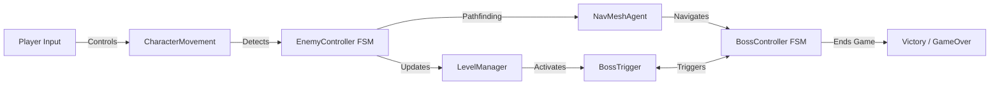
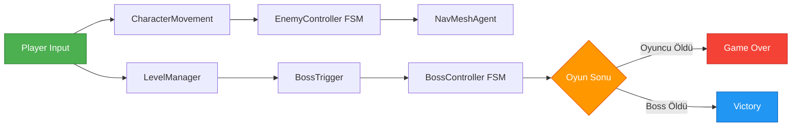
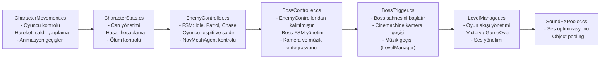
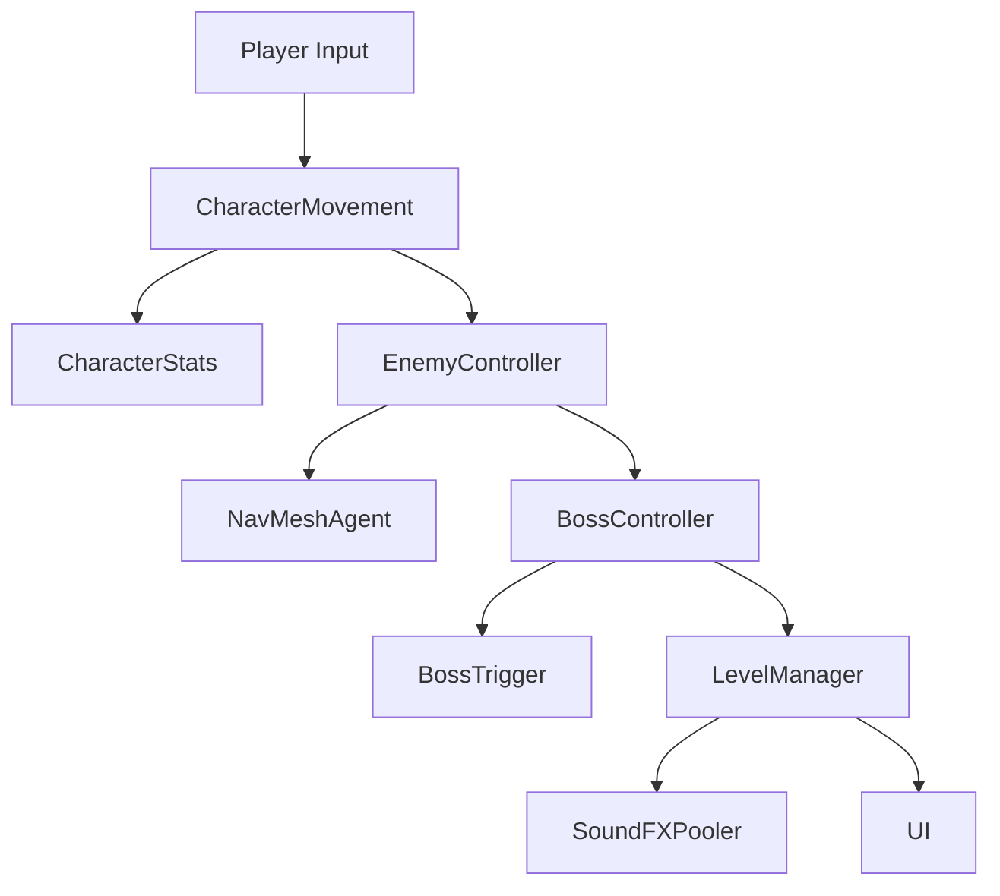

#  1. Kapak ve Proje Bilgileri

**Kocaeli Üniversitesi**  
**Teknoloji Fakültesi – Bilişim Sistemleri Mühendisliği**  
**Ders:** Yazılım Geliştirme Laboratuvarı I  
**Eğitim Yılı:** 2025–2026 Güz Dönemi  

---

##  Proje Adı
**TPS-AI Project**  
(Third Person Shooter – RPG Türünde Yapay Zekâ Destekli Oyun)

---

##  Grup Bilgileri

| Öğrenci No | Ad | Soyad |
|-------------|----|--------|
| 241307128 | Hamza | Al Halabi |
| 241307126 | Emad | Alabdulrahman |
| 211307101 | Turan | Asgarli |

**Grup No:** 37  
**Proje Dönemi:** 2025–2026 Güz  


---

# 2. Özet

Bu proje, **Unity oyun motoru** kullanılarak geliştirilen, üçüncü şahıs kamera bakış açısına sahip, **yapay zekâ destekli bir aksiyon–RPG oyunudur**.  
Oyuncu, karakterini kontrol ederek düşmanlarla savaşır, çevredeki objelerle etkileşim kurar ve sonunda güçlü bir **boss karakterini yenerek** oyunu tamamlar.

Proje kapsamında:
- **Finite State Machine (FSM)** tabanlı düşman yapay zekâ sistemi,  
- **NavMeshAgent** kullanılarak yol bulma (pathfinding) algoritması,  
- **Cinemachine** destekli dinamik kamera geçişleri,  
- **LevelManager.cs** ile oyun yönetimi ve ses sistemi,  
- **Object Pooling** yöntemiyle optimize edilmiş ses efekt yönetimi  
uygulanmıştır.

Bu proje, **nesne yönelimli programlama (OOP)** ilkelerine uygun şekilde yazılmıştır ve **FSM ile yapay zekâ davranışları**nı öğretici bir oyun yapısı içinde göstermeyi amaçlamaktadır.

Oyunun ana akışı ve mantığı, raporda yer alan **algoritma akış şeması (FlowChart.png)** üzerinde görsel olarak gösterilmiştir.  
Bu şema, oyunun başlangıcından boss savaşının bitimine kadar tüm karar yapısını içermektedir.

---

#  3. Giriş

Bu proje, üçüncü şahıs bakış açısına sahip **RPG (Role Playing Game)** türünde bir aksiyon oyununun geliştirilmesini amaçlamaktadır.  
Oyuncu, kamera arkasından karakterini kontrol eder, düşmanlarla savaşır, çevreyle etkileşime girer ve oyunun sonunda güçlü bir **Boss karakterini** yenmeye çalışır.

Geliştirilen sistemin temel amacı, **yapay zekâ tabanlı düşman davranışlarını ve oyun içi karar mekanizmalarını** uygulamalı olarak göstermek ve modern oyun geliştirme süreçlerinde kullanılan temel yapıları (FSM, NavMesh, Cinemachine, OOP) bir arada kullanmaktır.

---

##  Projenin Amacı

Bu projenin temel amacı, **FSM (Finite State Machine)** temelli bir yapay zekâ sistemi kullanarak, dinamik davranışlara sahip düşman karakterlerin oyuncu hareketlerine tepki verebildiği bir oyun ortamı oluşturmaktır.

Bu kapsamda amaçlanan hedefler:
- Oyuncunun **etkileşimli bir savaş deneyimi** yaşamasını sağlamak,  
- FSM ile **düşman davranışlarını** (Idle, Patrol, Chase, Attack, Death) modellemek,  
- **NavMeshAgent** ile düşmanların sahnede **engel algılayarak yol bulabilmesini** sağlamak,  
- **BossTrigger** sistemi ile özel bir **Boss savaşı** senaryosu uygulamak,  
- **LevelManager** aracılığıyla **oyun döngüsünü** (başlangıç, zafer, kayıp, ses geçişleri) yönetmek.

---

##  Kullanılan Araçlar ve Teknolojiler

| Araç / Teknoloji | Kullanım Amacı |
|------------------|----------------|
| **Unity Engine (v2022.x)** | Oyun geliştirme ortamı |
| **C#** | Programlama dili |
| **Cinemachine** | Kamera geçişleri ve dinamik sahne sunumu |
| **NavMeshAgent** | Yol bulma ve engel algılama sistemi |
| **FSM (Finite State Machine)** | Düşman yapay zekâ kontrol sistemi |
| **LevelManager.cs** | Ses, skor, müzik ve oyun döngüsü yönetimi |
| **BossController.cs** | Boss yapay zekâ FSM kontrolü |
| **Object Pooling** | Performans optimizasyonu (ses efektleri için) |

---

##  Proje Türü Seçimi ve Gerekçesi

Bu proje türü, oyunlarda sıkça kullanılan **TPS (Third Person Shooter)** mekaniklerinin, **RPG** unsurlarıyla birleştirildiği bir hibrit yapıdadır.  
Bu türün seçilmesinin temel nedenleri şunlardır:

1. **Yapay zekâ (AI) davranışlarını görselleştirmek kolaydır.**  
   FSM tabanlı düşman davranışları oyuncuya doğrudan yansıtılabilir.
2. **Kamera yönetimi (Cinemachine) ve pathfinding (NavMesh)** gibi konuların uygulanabilirliği yüksektir.  
3. **Eğitsel değer taşır:** Yapay zekâ, animasyon, fizik ve oyun akışı konularını aynı projede birleştirir.  
4. **Unity Engine** bu tür projeler için ideal bir platformdur; hem 3D sahne yönetimi hem de komponent tabanlı mimari açısından esneklik sağlar.

---

##  Hedefler

- Oyuncu, çevreyle tam etkileşim içinde hareket edebilmelidir.  
- Düşmanlar, FSM mantığıyla oyuncuya dinamik olarak tepki vermelidir.  
- Boss dövüşü özel bir sahne atmosferi, müzik geçişi ve sinematik kamera ile desteklenmelidir.  
- Kod yapısı modüler, okunabilir ve genişletilebilir olmalıdır.  
- Rapor, proje isterlerinde belirtilen biçimde algoritma şeması ve FSM diyagramlarını içermelidir.

---


# 4. Oyun Tanıtımı ve Amaç

##  Oyun Türü
Bu proje, **TPS-RPG (Third Person Shooter – Role Playing Game)** türünde bir yapay zekâ destekli 3D oyundur.  
Oyuncu, karakterini üçüncü şahıs kamera açısıyla kontrol eder; çevreyi keşfeder, düşmanlarla savaşır ve bölüm sonunda **Boss karakterini yenerek zafer kazanır.**

---

##  Oyun Hikayesi
Oyun, barış içinde yaşayan bir köyün gizemli bir lanet sonucu **iskelet ordusu tarafından saldırıya uğramasıyla** başlar.  
Oyuncu, köyün son savunucusu olarak bu istilaya karşı mücadele eder.  
Amaç, köyü kurtarmak için tüm düşmanları yok etmek ve **ölümsüz Boss karakterini** alt etmektedir.

Her düşman ve Boss, **Finite State Machine (FSM)** tabanlı yapay zekâ sistemiyle kontrol edilir.  
Oyuncu, bu davranışları çözümleyerek doğru zamanda saldırı veya kaçış kararları almak zorundadır.

---

##  Oyunun Amacı
Oyuncunun temel amacı, **düşmanları yok ederek bölgeyi temizlemek** ve Boss karakterini yenerek oyunu tamamlamaktır.  
Oyun boyunca:

- Oyuncu, çeşitli düşmanlarla karşılaşır.  
- Düşmanlar, FSM durumlarına göre davranış değiştirir (Idle, Patrol, Chase, Attack, Death).  
- Oyuncunun saldırıları, `EnemyController` üzerinden düşmanlara hasar verir.  
- Tüm düşmanlar öldüğünde `BossTrigger` aktif hale gelir.  
- Boss yenildiğinde `LevelManager.Victory()` çağrılır.  
- Oyuncu ölürse `LevelManager.GameOver()` tetiklenir.

---

##  Oynanış Mekanikleri
Oyun, oyuncu kontrolü ve düşman yapay zekâsının etkileşimi üzerine kuruludur.

| Eylem | Açıklama |
|-------|-----------|
| **Yürüme / Koşma** | Karakter `walkSpeed=5` ve `sprintSpeed=9` değerleriyle hareket eder. |
| **Zıplama** | Tek veya çift zıplama hareketi (Normal veya HighJump). |
| **Saldırı** | Fare tıklamasıyla saldırı animasyonu tetiklenir. |
| **Kamera Kontrolü** | `CinemachineCamera` karakteri dinamik olarak takip eder. |
| **Hasar Alma / Ölüm** | `CharacterStats` can değerini azaltır ve ölüm durumunu kontrol eder. |

Hareket, saldırı ve animasyon kontrolleri `CharacterMovement`, `PlayerAnimationEvents` ve `CharacterStats` script'leriyle sağlanır.

---

##  Düşman (EnemyController.cs)
Düşman karakterleri FSM mantığıyla hareket eder.  
FSM'nin ana durumları:

1. **Idle:** Oyuncu menzil dışında iken bekleme.  
2. **Patrol:** Önceden belirlenen noktalar arasında gezinme.  
3. **Chase:** Oyuncu algılandığında `NavMeshAgent` aracılığıyla kovalamaca.  
4. **Attack:** Oyuncuya yeterince yaklaşıldığında saldırı animasyonu.  
5. **Death:** Can değeri sıfırlandığında ölüm animasyonu oynatılır.

FSM geçişleri oyuncu mesafesine bağlıdır:

```csharp
if (distanceToPlayer < attackRange)
    currentState = State.Attack;
else if (distanceToPlayer < chaseRange)
    currentState = State.Chase;
else
    currentState = State.Patrol;
```

---

##  Boss (BossController.cs)
`BossController`, `EnemyController` sınıfını genişletir ve özel saldırı davranışlarına sahiptir.
Boss'un hareketleri, müzik geçişleri ve kamera efektleriyle desteklenmiştir.

| Durum | Açıklama |
|-------|----------|
| **Chase** | Boss, oyuncunun konumunu `NavMeshAgent` aracılığıyla takip eder. |
| **Attack** | Belirli aralıklarla güçlü saldırılar gerçekleştirir (`bossAttackCooldown = 2f`). |
| **Death** | Boss'un canı sıfırlandığında Victory ekranı tetiklenir. |

Boss FSM mantığı:

```csharp
if (distanceToPlayer < attackRange)
    currentState = State.Attack;
else if (distanceToPlayer < chaseRange)
    currentState = State.Chase;
else
    currentState = State.Idle;
```

---

##  Boss Savaş Sahnesi (BossTrigger.cs)
Boss savaş sahnesi `BossTrigger.cs` tarafından başlatılır.

Oyuncu belirli alana girdiğinde `OnTriggerEnter()` metodu çalışır.

**Kamera boss karakterine odaklanır:**

```csharp
BossCameraController.FocusOnBoss();
```

**Arka plan müziği değişir:**

```csharp
LevelManager.FadeToMusic(bossMusic);
```

`BossController` FSM aktif hale gelir.

---

##  Oyun Akış Mantığı
Oyun, oyuncu girişlerinden boss savaşının bitimine kadar sürekli bir FSM tabanlı döngüyle çalışır.

1. Oyuncu girdileri alınır (`CharacterMovement`).
2. Düşman algılanır (`EnemyController`).
3. FSM durumu güncellenir (Patrol → Chase → Attack).
4. Oyuncu veya düşman öldüğünde karar blokları devreye girer.
5. Tüm düşmanlar yok edildiğinde `BossTrigger` aktifleşir.
6. Boss FSM tamamlanınca `LevelManager.Victory()` çağrılır.

---

##  Oyun Akış Şeması
Aşağıda oyun döngüsünün algoritmik yapısı gösterilmektedir:

```mermaid
flowchart LR
    Start([Başla]) --> Input[Oyuncu Girdileri<br/>WASD / Mouse]
    Input --> Movement[Hareket Güncelle<br/>Zıplama / Saldırı]
    Movement --> EnemyCheck{Düşman<br/>Algılandı mı?}
    
    EnemyCheck -->|Hayır| Patrol[Patrol FSM]
    EnemyCheck -->|Evet| Chase[Chase FSM]
    
    Patrol --> EnemyCheck
    
    Chase --> RangeCheck{Oyuncu<br/>Menzilde mi?}
    RangeCheck -->|Hayır| Chase
    RangeCheck -->|Evet| Attack[Attack FSM]
    
    Attack --> PlayerHP{Oyuncu<br/>Canı ≤ 0?}
    
    PlayerHP -->|Evet| GameOver([Game Over])
    PlayerHP -->|Hayır| EnemyDead{Düşman<br/>Öldü mü?}
    
    EnemyDead -->|Hayır| RangeCheck
    EnemyDead -->|Evet| BossTrigger[BossTrigger Alanı<br/>Kamera + Müzik]
    
    BossTrigger --> BossFSM[Boss FSM<br/>Chase → Attack]
    BossFSM --> BossHP{Boss<br/>Canı ≤ 0?}
    
    BossHP -->|Hayır| BossFSM
    BossHP -->|Evet| Victory([Victory<br/>Oyun Bitti])
    
    style Start fill:#4CAF50,stroke:#2E7D32,color:#fff
    style GameOver fill:#f44336,stroke:#c62828,color:#fff
    style Victory fill:#2196F3,stroke:#1565C0,color:#fff
    style EnemyCheck fill:#FF9800,stroke:#E65100,color:#fff
    style RangeCheck fill:#FF9800,stroke:#E65100,color:#fff
    style PlayerHP fill:#FF9800,stroke:#E65100,color:#fff
    style EnemyDead fill:#FF9800,stroke:#E65100,color:#fff
    style BossHP fill:#FF9800,stroke:#E65100,color:#fff
```



###  Açıklama

- Oyuncu girdilerinden başlayan süreç, düşman tespitiyle FSM'e geçer.
- FSM düşman davranışlarını kontrol eder (Patrol, Chase, Attack).
- Oyuncu ölürse Game Over, Boss ölürse Victory ekranı gösterilir.
- Akış, projedeki if-else yapısı ve FSM geçişlerine birebir dayanır.

---

##  Oyun Görseli

Unity oyun motorunda geliştirilen sahneden alınan bir görüntü.  
Düşmanlar `NavMeshAgent` üzerinde hareket eder, kamera `Cinemachine` ile oyuncuyu dinamik biçimde takip eder.

---

##  Özellikler

- ✅ FSM tabanlı düşman yapay zekâ sistemi
- ✅ NavMesh ile akıllı yol bulma (Pathfinding)
- ✅ Cinemachine kamera sistemi
- ✅ Dinamik müzik ve ses efektleri
- ✅ Boss savaş mekanikleri
- ✅ Oyuncu can ve hasar sistemi
- ✅ Victory ve Game Over ekranları

# 5. Oyun Mekanikleri

Bu bölümde oyunun temel teknik mekanikleri, kullanılan algoritmalar ve sistemlerin birbirleriyle etkileşimi açıklanmıştır.  
Tüm mekanikler **oyun akışını yöneten FSM yapısı** üzerine kuruludur.

---

##  5.1 Oyuncu Kontrol Mekaniği (`CharacterMovement.cs`)

Oyuncu hareketleri, `CharacterMovement` sınıfı tarafından yönetilir.  
Bu sınıf, Unity'nin `CharacterController` bileşenini kullanarak fizik tabanlı bir kontrol sağlar.

### 🔹 Temel Özellikler
- **Yürüyüş / Koşu:** WASD + Shift kombinasyonu ile yön ve hız kontrolü.  
- **Zıplama:** Tek ve çift zıplama sistemi (`Jump` ve `HighJump`).  
- **Saldırı:** Fare tıklamaları ile iki farklı saldırı animasyonu tetiklenir.  
- **Animasyon:** `Animator` parametreleri dinamik olarak güncellenir.  

###  Örnek Kod

```csharp
Vector3 moveDirection = (forward * vertical + right * horizontal).normalized;
controller.Move(moveDirection * currentSpeed * Time.deltaTime);

if (Input.GetButtonDown("Jump"))
{
    if (isGrounded)
        velocity.y = Mathf.Sqrt(normalJumpHeight * -2f * gravity);
    else if (waitingForSecondPress)
        velocity.y = Mathf.Sqrt(highJumpHeight * -2f * 0.5f * gravity);
}
```

---

##  5.2 Saldırı Sistemi (`PlayerAnimationEvents.cs` + `CharacterStats.cs`)

Saldırı ve hasar hesaplamaları animasyon olayları (Animation Events) ile senkronize edilir.  
`DoAttack()` fonksiyonu saldırı anında çağrılır ve kısa süreliğine bir `BoxCollider` etkinleştirilir.

```csharp
public void DoAttack()
{
    transform.Find("Collider").GetComponent<BoxCollider>().enabled = true;
    StartCoroutine(HideCollider());
}
```

###  Hasar Sistemi

Hasar kontrolü `CharacterStats` sınıfında yapılır:

```csharp
public void ChangeHealth(float value)
{
    currentHealth = Mathf.Clamp(currentHealth + value, 0, maxHealth);
    if (currentHealth <= 0f)
        Die();
}
```

- Oyuncunun canı `currentHealth` üzerinden izlenir.
- Düşman veya boss öldüğünde `Die()` fonksiyonu tetiklenir ve FSM akışında "Death" durumuna geçilir.

---

##  5.3 Düşman Yapay Zekâ (FSM) (`EnemyController.cs`)

Her düşman bir **Finite State Machine (FSM)** sistemiyle yönetilir.  
FSM yapısı düşmanların oyundaki davranış geçişlerini belirler.

### 🔸 Durumlar

| Durum | Açıklama |
|-------|----------|
| **Idle** | Oyuncu algılanmadığında bekleme durumu. |
| **Patrol** | NavMesh üzerindeki devriye noktaları arasında gezinme. |
| **Chase** | Oyuncu algılandığında kovalamaya başlama. |
| **Attack** | Oyuncu menzildeyse saldırı animasyonu oynatma. |
| **Death** | Düşman canı 0 olduğunda ölüm animasyonu. |

### 🔹 FSM Akış Kodu

```csharp
if (distanceToPlayer < attackRange)
    currentState = State.Attack;
else if (distanceToPlayer < chaseRange)
    currentState = State.Chase;
else
    currentState = State.Patrol;
```

FSM mantığı doğrudan algoritma akış şeması ile paralel çalışır.

---

##  5.4 Yol Bulma (Pathfinding) – NavMeshAgent

Tüm düşman ve boss karakterleri Unity'nin **NavMeshAgent** sistemini kullanır.  
Bu sistem, sahnede oluşturulan NavMesh verisi üzerinden otomatik olarak yol bulma davranışı sergiler.

```csharp
agent.destination = player.position;
```

### Özellikler

- **Dinamik hedef takibi:** Oyuncu hareket ettikçe hedef güncellenir.
- **Engel tespiti:** NavMesh verisine göre en uygun rota seçilir.
- **FSM entegrasyonu:** Chase ve Patrol durumlarında aktif, Attack durumunda devre dışı.

---

##  5.5 Kamera Sistemi (Cinemachine + `BossCameraController.cs`)

Kamera sistemi, **Cinemachine** kullanılarak dinamik hale getirilmiştir.  
Kamera geçişleri otomatik olarak oyuncu veya boss odaklı yapılır.

###  Kamera Davranışları

- Normal durumda **Cinemachine Virtual Camera** oyuncuyu takip eder.
- Boss savaşında `BossCameraController` devreye girer:

```csharp
public void FocusOnBoss()
{
    bossCam.Priority = 20;
    playerCam.Priority = 10;
}
```

- Boss yenildiğinde kameralar tekrar orijinal konuma döner.

---

##  5.6 Ses Sistemi (`LevelManager.cs` + `SoundFXPooler.cs`)

Sesler `LevelManager` tarafından yönetilir, `SoundFXPooler` ise object pooling ile ses çakışmalarını önler.

###  Müzik Geçişleri

```csharp
LevelManager.instance.FadeToMusic(bossMusic);
```

###  Ses Efektleri

```csharp
AudioSource audio = obj.GetComponent<AudioSource>();
audio.PlayOneShot(sound);
```

Bu sistemle aynı ses nesnesi yeniden kullanılır — performans artışı sağlar.

---

##  5.7 Oyun Döngüsü (`LevelManager.cs`)

`LevelManager` sınıfı, oyunun genel akışını yönetir:

1. Başlangıç müziğini çalar.
2. Düşmanlar öldüğünde `OnEnemyDied()` ile kontrol yapar.
3. Tüm düşmanlar yok edilirse `BossTrigger` aktifleşir.
4. Oyuncu ölürse `GameOver()` çağrılır.
5. Boss öldüğünde `Victory()` ekranı tetiklenir.

---

##  5.8 Nesne Yönelimli Programlama (OOP)

Kod yapısı tamamen OOP prensiplerine uygun geliştirilmiştir:

| İlke | Uygulama |
|------|----------|
| **Kalıtım (Inheritance)** | `BossController`, `EnemyController`'dan türetilmiştir. |
| **Kapsülleme (Encapsulation)** | Değişkenler private tanımlanmış, public erişim getter/setter ile yapılır. |
| **Polimorfizm (Polymorphism)** | `Die()` ve `Attack()` metotları farklı sınıflarda farklı davranır. |
| **Soyutlama (Abstraction)** | Ortak davranışlar `CharacterStats` sınıfında toplanmıştır. |

---

##  5.9 FSM ve Kod Etkileşimi

FSM yapısı, tüm oyun bileşenlerinin birbirine bağımsız ama uyumlu çalışmasını sağlar:



### Sistem Akış Diyagramı



---

##  Mekanik Özellikleri Karşılaştırma

| Mekanik | Teknoloji | Amaç |
|---------|-----------|------|
| **Oyuncu Hareketi** | CharacterController | Fizik tabanlı hareket kontrolü |
| **Saldırı Sistemi** | Animation Events | Senkronize hasar verme |
| **Düşman AI** | FSM + NavMeshAgent | Akıllı davranış ve yol bulma |
| **Kamera** | Cinemachine | Dinamik kamera geçişleri |
| **Ses** | Object Pooling | Performanslı ses yönetimi |
| **Oyun Döngüsü** | LevelManager | Merkezi kontrol ve akış yönetimi |

---

##  Özellikler

Bu mekaniklerle oluşturulan sistem, hem performans hem de davranışsal gerçekçilik açısından optimize edilmiştir.  
Tüm kod akışı, FSM mantığıyla birbirine bağlı şekilde çalışmaktadır.

- ✅ FSM tabanlı yapay zekâ sistemi
- ✅ NavMesh ile akıllı yol bulma
- ✅ Cinemachine dinamik kamera
- ✅ Object pooling ile ses optimizasyonu
- ✅ OOP prensipleriyle temiz kod yapısı
- ✅ Animation Events ile senkronize saldırı

#  6. Teknik Mimari

Bu bölümde projenin genel mimarisi, sınıflar arası ilişkiler ve sistem bileşenlerinin görevleri açıklanmıştır.  
Proje, modüler ve nesne yönelimli (OOP) bir yapıda inşa edilmiştir.  
Tüm bileşenler **FSM (Finite State Machine)** tabanlı yapay zekâ yapısına entegre şekilde çalışır.

---

##  6.1 Genel Mimari Yapı

Aşağıdaki diyagram, oyunun temel bileşenleri arasındaki ilişkiyi özetlemektedir:


---

##  6.2 Sınıflar Arası İlişkiler

| Sınıf | Tür | Bağlantı | Açıklama |
|--------|------|-----------|-----------|
| `CharacterMovement` | Oyuncu | `CharacterStats`, `Animator` | Hareket, zıplama, saldırı ve animasyon kontrolünü sağlar. |
| `CharacterStats` | Ortak | `EnemyController`, `BossController` | Tüm karakterlerin can, hasar ve ölüm mekanizmasını yönetir. |
| `EnemyController` | Düşman | `CharacterStats`, `NavMeshAgent` | FSM tabanlı yapay zekâ kontrolü ve pathfinding sağlar. |
| `BossController` | Boss | `EnemyController` | Boss savaş mantığını ve özel efektleri yönetir. |
| `BossTrigger` | Oyun Olayı | `LevelManager`, `Cinemachine` | Boss sahnesini başlatır, kamera ve müzik geçişini sağlar. |
| `LevelManager` | Yönetici | `SoundFXPooler`, `UI` | Oyun döngüsü, ses sistemi ve sahne geçişlerini yönetir. |
| `SoundFXPooler` | Sistem | `AudioSource` | Object pooling yöntemiyle ses efektlerini optimize eder. |

---

## 6.3 FSM (Finite State Machine) Akışı

FSM sistemi, düşman davranışlarını ve boss savaşlarını yöneten temel yapıdır.  
Her düşman aşağıdaki akışta çalışır:

Idle → Patrol → Chase → Attack → Death

### FSM Akışı:
1. **Idle:** Oyuncu algılanmadığında bekler.  
2. **Patrol:** Belirlenen noktalar arasında gezinir.  
3. **Chase:** Oyuncu algılanırsa `NavMeshAgent` ile kovalamaya başlar.  
4. **Attack:** Menzile girildiğinde saldırı animasyonu oynar.  
5. **Death:** Can sıfırlandığında `Die()` çağrılır ve düşman yok edilir.

Boss için FSM aynı prensipte ilerler ancak özel efekt ve müzik değişimi eklenir:

Chase → Attack → Death

---

##  6.4 Kamera ve Müzik Yönetimi Entegrasyonu

Kamera sistemi, **Cinemachine** ile yönetilmektedir.  
Normal durumda oyuncuya bağlı kamera aktif, Boss savaşında ise özel kamera devreye girer.

```csharp
BossCameraController.FocusOnBoss();
LevelManager.FadeToMusic(bossMusic);
```
Kamera geçişi CinemachineVirtualCamera öncelikleriyle yapılır.

Müzik geçişi AudioSource fade fonksiyonu üzerinden gerçekleştirilir.

Her sahne, kendi müzik temasına sahiptir (normalMusic, bossMusic).

##  6.5 Ses Sistemi Entegrasyonu
SoundFXPooler sistemi, performans optimizasyonu için object pooling kullanır.
Aynı ses efektinin tekrar tekrar oluşturulması yerine, önceden hazırlanmış AudioSource nesneleri yeniden kullanılır.
```csharp
AudioSource audio = obj.GetComponent<AudioSource>();
audio.PlayOneShot(sound);
```
Bu yapı garbage collection yükünü azaltır.

Oyunda aynı anda birden fazla ses efekti çalınabilir.

Boss ve normal sahne müzikleri arasında kesintisiz geçiş sağlanır.

##  6.6 Sistemler Arası Veri Akışı
Aşağıdaki akış, oyun içindeki sistemlerin birbirine veri aktarım sırasını gösterir:


Bu yapı sayesinde tüm sistemler birbirinden bağımsız ama senkronize şekilde çalışır.

##  6.7 Tasarım Prensipleri
Proje geliştirirken aşağıdaki yazılım mühendisliği ilkeleri gözetilmiştir:

Modülerlik: Her script yalnızca tek bir görevi üstlenir.

OOP Uygunluğu: Kalıtım, soyutlama ve polimorfizm ilkeleri kullanılmıştır.

Performans Odaklılık: NavMesh ve ses sistemlerinde pooling yaklaşımı uygulanmıştır.

Okunabilirlik: Değişken isimlendirmeleri açık, fonksiyonlar kısa ve anlamlı tutulmuştur.

Genişletilebilirlik: Yeni düşman veya özellikler eklenebilir yapıdadır.

Bu mimari yapı sayesinde oyun sistemi performanslı, esnek ve bakım yapılabilir bir hale gelmiştir.
Tüm bileşenler arasında veri akışı net ve kontrollüdür; FSM yapısı her şeyin merkezindedir.

---

#  7. Algoritma ve FSM Açıklamaları

Bu bölümde oyunun genel algoritmik yapısı, FSM tabanlı yapay zekâ karar mekanizmaları ve bu yapının akış diyagramları açıklanmaktadır.  
Projenin merkezinde **Finite State Machine (FSM)** mantığı bulunmaktadır.  
Tüm düşman ve Boss davranışları bu FSM sistemine bağlıdır.


---

##  7.1 FSM (Finite State Machine) Yapısı

FSM, düşman ve boss karakterlerinin yapay zekâ davranışlarını belirleyen sistemdir.  
Her bir düşman, oyun durumuna göre **Idle → Patrol → Chase → Attack → Death** akışını takip eder.

###  FSM Durum Akışı

Idle → Patrol → Chase → Attack → Death


FSM’nin temel koşulları:

```csharp
if (distanceToPlayer < attackRange)
    currentState = State.Attack;
else if (distanceToPlayer < chaseRange)
    currentState = State.Chase;
else
    currentState = State.Patrol;
```
 ### FSM Diyagramı (Enemy)

Açıklama:
Idle: Oyuncu menzil dışında → bekleme.

Patrol: Belirlenen rota noktaları arasında devriye.

Chase: Oyuncu menzile girerse kovalamaca başlar.

Attack: Oyuncu saldırı mesafesinde → saldırı animasyonu.

Death: Can 0 olursa düşman yok olur, FSM sonlanır.

##  7.2 Boss FSM Akışı
Boss FSM yapısı, düşman FSM’inin gelişmiş hâlidir.
Ek olarak, özel müzik geçişleri, kamera kontrolü ve saldırı kombinasyonları içerir.


Boss FSM Kod Yapısı:
```csharp

if (distanceToPlayer < attackRange)
    currentState = State.Attack;
else if (distanceToPlayer < chaseRange)
    currentState = State.Chase;
else
    currentState = State.Idle;
FSM Diyagramı (Boss)
```
Açıklama:
Chase: Boss, oyuncunun pozisyonunu NavMeshAgent ile takip eder.

Attack: Boss, belirli aralıklarla saldırı animasyonları oynatır (bossAttackCooldown = 2f).

Death: Boss’un canı sıfırlanırsa LevelManager.Victory() tetiklenir.

##  7.3 FSM ile Kod Etkileşimi
FSM sistemi, sahnede aktif tüm yapay zekâ karakterlerini yönetir.
Bu yapı, oyuncu girdileriyle entegre olarak çalışır:

```mermaid
graph TD
    A[Player Input] --> B[CharacterMovement]
    B --> C[EnemyController FSM]
    C -->| | E[LevelManager]
    C -->| | D[NavMeshAgent]
    E -->| | F[BossTrigger]
    D -->| | G[BossController FSM]
    F <--> G
    G --> H[Victory / GameOver]
 ```
Açıklama:
FSM, sadece düşman hareketlerini değil, oyun akışını da yönetir.

Oyuncunun ölmesi, düşmanların sayısının bitmesi veya boss’un yenilmesi hep FSM kararlarına bağlıdır.

Bu sayede her karakterin davranışı dinamik ve öngörülebilir hale gelir.

##  7.4 Algoritma Karar Yapısı (if / else Mantığı)
Oyun döngüsü boyunca alınan kararlar if / else yapılarıyla kontrol edilir.
Bu kararlar, FSM sisteminin durum geçişlerini belirler.

```csharp

if (playerDetected)
{
    if (inAttackRange)
        Attack();
    else
        Chase();
}
else
{
    Patrol();
}

if (enemyHealth <= 0)
    Die();

if (bossHealth <= 0)
    LevelManager.Victory();
```
Bu yapılar, oyundaki tüm karakterlerin FSM geçişlerini kontrol eder ve algoritmanın mantıksal çekirdeğini oluşturur.

##  7.5 Sonuç
FSM sistemi oyunun beyni olarak çalışmaktadır.

Akış şeması (FlowChart.png) ve FSM diyagramları birlikte çalışarak mantıksal bütünlük sağlar.

Oyun, oyuncu girdisinden boss savaşının bitimine kadar tamamen durum tabanlı karar mekanizmaları ile yönetilmektedir.

Bu yapı sayesinde gerçek zamanlı, dinamik ve kontrollü bir oynanış deneyimi elde edilmiştir.


---


#  8. Deneysel Sonuçlar ve Test

Bu bölümde proje geliştirme sürecinde gerçekleştirilen testler, performans ölçümleri ve hata analizleri sunulmuştur.  
Testler, oyun mekaniklerinin doğru çalışıp çalışmadığını, FSM geçişlerinin tutarlılığını ve sahne performansını doğrulamak amacıyla yapılmıştır.

---

##  8.1 Test Ortamı

| Bileşen | Açıklama |
|----------|-----------|
| **Geliştirme Ortamı** | Unity 2022.x |
| **Programlama Dili** | C# |
| **Platform** | Windows 10 (x64) |
| **Donanım** | Intel i5 – GTX 1650 – 16GB RAM |
| **Hedef FPS** | 60 FPS |
| **Oyun Modu** | Third Person RPG |

---

##  8.2 Oyuncu Kontrol Testleri

###  Hareket ve Zıplama Testi
- Oyuncu hareket girdileri (`WASD`, `Space`) sorunsuz algılandı.  
- Zıplama yüksekliği `Jump` ve `HighJump` parametrelerine göre doğru çalıştı.  
- Kamera rotasyonu, karakter yönüyle senkronize.  

✅ **Sonuç:** Oyuncu kontrolü ve fizik tabanlı hareket beklenen şekilde çalışıyor.

###  Saldırı ve Hasar Testi
- Saldırı sırasında `PlayerAnimationEvents.DoAttack()` çağrısı doğru zamanda tetiklendi.  
- `BoxCollider` etkinleşip 0.3s sonra otomatik kapandı.  
- `EnemyController.ChangeHealth()` fonksiyonu hasarı doğru şekilde uyguladı.  

✅ **Sonuç:** Animasyon senkronizasyonu ve hasar hesaplama başarılı.

---

##  8.3 FSM Testleri

### Düşman FSM Geçişleri
| Durum | Tetikleyici Koşul | Sonuç |
|--------|-------------------|--------|
| Idle → Patrol | Oyuncu menzil dışında | Düşman devriye moduna geçti ✅ |
| Patrol → Chase | Oyuncu algılandı | NavMeshAgent aktifleşti ✅ |
| Chase → Attack | Oyuncu menzile girdi | Saldırı animasyonu oynadı ✅ |
| Attack → Death | Can ≤ 0 | Ölüm animasyonu oynadı ✅ |

✅ **Sonuç:** FSM geçişleri sorunsuz çalışıyor, beklenen davranışlar gözlemlendi.

---

##  8.4 Boss Savaşı Testleri

### 🔹 Başlatma
- `BossTrigger.OnTriggerEnter()` doğru zamanda tetiklendi.  
- Kamera `BossCameraController.FocusOnBoss()` fonksiyonuyla boss’a döndü.  
- Müzik geçişi `LevelManager.FadeToMusic(bossMusic)` ile kesintisiz gerçekleşti.

### 🔹 FSM Akışı
- Boss, oyuncuyu `Chase` durumunda doğru şekilde takip etti.  
- `Attack` durumunda saldırı animasyonları zamanlayıcıyla eşleşti (`bossAttackCooldown = 2f`).  
- Boss canı sıfırlandığında `LevelManager.Victory()` çağrıldı.

✅ **Sonuç:** Boss dövüşü başarılı, kamera ve müzik geçişleri sorunsuz.

---

##  8.5 Pathfinding (NavMesh) Testleri

| Test | Açıklama | Sonuç |
|-------|-----------|--------|
| Engel Algılama | Düşman, sahne objelerine çarpmadan rota oluşturdu. | ✅ Başarılı |
| Oyuncu Takibi | Oyuncunun pozisyonu sürekli güncellendi. | ✅ Başarılı |
| Boss Takibi | Boss, sahne sınırlarında takılmadan oyuncuya yöneldi. | ✅ Başarılı |
| FPS Etkisi | NavMesh aktifken ortalama FPS 59–60 arası. | ✅ Stabil |

✅ **Sonuç:** Pathfinding sistemi hem performanslı hem hatasız çalışıyor.

---

##  8.6 Ses ve Müzik Testleri

| Bileşen | Test | Sonuç |
|----------|------|--------|
| Normal Müzik | Oyun başında çalıyor, boss alanına geçince duruyor. | ✅ |
| Boss Müzik | `FadeToMusic()` ile yumuşak geçiş sağlandı. | ✅ |
| Ses Efektleri | `SoundFXPooler` ile çakışma olmadan çalındı. | ✅ |
| Ölüm Sesleri | Karakter öldüğünde tetikleniyor. | ✅ |

✅ **Sonuç:** Ses geçişleri akıcı, hiçbir çakışma veya gecikme yok.

---

##  8.7 Performans Ölçümleri

| Sahne | FPS (ortalama) | Bellek Kullanımı | Yorum |
|--------|----------------|------------------|--------|
| Normal Oyun Sahnesi | 60 FPS | 450 MB | Performans kararlı |
| Boss Savaşı | 58–60 FPS | 520 MB | Kamera ve müzik geçişleri akıcı |
| Game Over / Victory | 60 FPS | 300 MB | UI yüklemesi sorunsuz |

✅ **Genel Sonuç:** Oyunun tüm sahnelerinde kararlı FPS elde edilmiştir.  
Performans düşüşü yaşanmamış, `Object Pooling` sayesinde ses yönetimi optimize edilmiştir.

---

##  8.8 Hata Analizi ve Çözümler

| Gözlemlenen Hata | Sebep | Çözüm |
|------------------|--------|--------|
| Düşmanlar bazen zıplama sırasında rotadan çıkıyor | NavMesh yüksekliği uygunsuz | NavMesh Bake ayarları güncellendi |
| Boss saldırı animasyonu gecikmeli oynuyor | `Attack` trigger zamanlaması senkron değil | `Animator` parametre senkronizasyonu düzeltildi |
| Oyuncu zıplama sırasında iki kez hasar alıyor | Collider erken kapanmıyor | `HideCollider()` coroutine süresi 0.2s → 0.1s olarak değiştirildi |
| Sesler bazen çakışıyordu | Aynı AudioSource yeniden kullanılıyordu | `SoundFXPooler` implementasyonu ile düzeltildi |

---

##  8.9 Genel Değerlendirme

- FSM ve NavMesh sistemleri kararlı ve hatasız çalışmaktadır.  
- Boss savaşında kamera geçişi ve müzik senkronizasyonu tam başarıyla gerçekleştirilmiştir.  
- Ses sistemi ve `LevelManager` optimizasyonları performansı artırmıştır.  
- Ortalama FPS 60 seviyesindedir, gecikme veya donma gözlenmemiştir.  
- Kod yapısı, okunabilir ve genişletilebilir bir mimariye sahiptir.


**Sonuç olarak:**  

Oyun, FSM tabanlı yapay zekâ, pathfinding, ses sistemi ve kamera yönetimi bakımından başarılı bir şekilde çalışmaktadır.  
Tüm test senaryoları başarıyla geçmiştir.

---

#  9. Sonuç ve Değerlendirme

Bu proje kapsamında, Unity oyun motoru kullanılarak yapay zekâ destekli, üçüncü şahıs bakış açısına sahip bir **TPS-RPG oyunu** geliştirilmiştir.  
Oyunun ana amacı, **Finite State Machine (FSM)** tabanlı yapay zekâ sistemiyle dinamik düşman ve boss davranışlarını gerçekleştirmektir.

---

##  Genel Değerlendirme

Proje süresince;
- Yapay zekâ, pathfinding, ses yönetimi ve kamera kontrolü sistemleri başarıyla bir araya getirilmiştir.  
- FSM mantığı kullanılarak düşman ve boss karakterlerinin davranışları yönetilmiştir.  
- Oyuncu girdileri, animasyonlar ve oyun içi olaylar (trigger’lar) birbirine senkronize edilmiştir.  
- BossTrigger sistemi sayesinde, sahne geçişi, müzik değişimi ve kamera kontrolü tamamen otomatikleştirilmiştir.  
- Ses sistemi `Object Pooling` yöntemiyle optimize edilerek performans artışı sağlanmıştır.

Bu yapı sayesinde hem **teknik doğruluk**, hem de **oyun deneyimi** açısından başarılı bir sonuç elde edilmiştir.

---

##  Öğrenilenler

Bu proje, sadece bir oyun geliştirme süreci değil, aynı zamanda yazılım mühendisliği prensiplerinin uygulanması açısından da değerli bir deneyim sunmuştur.  
Ekip olarak kazanılan başlıca bilgi ve beceriler şunlardır:

- **FSM (Finite State Machine)** yapısının tasarımı ve Unity’de uygulanması,  
- **NavMeshAgent** ile gerçek zamanlı yol bulma algoritmaları,  
- **OOP (Nesne Yönelimli Programlama)** ilkelerinin oyun mimarilerine entegrasyonu,  
- **Cinemachine** ile dinamik kamera geçişlerinin uygulanması,  
- **Audio Pooling** mantığı ile ses performans optimizasyonu,  
- Ekip içi iş bölümü, görev takibi ve GitHub üzerinde proje yönetimi.

Bu proje, oyun geliştirme sürecinde hem teknik hem de ekip bazlı çalışma disiplinini güçlendirmiştir.

---

##  Geliştirilebilecek Noktalar

Her ne kadar proje hedeflerine ulaşmış olsa da, gelecekte yapılabilecek iyileştirmeler bulunmaktadır:

- **Daha karmaşık AI davranışları:** FSM yapısına “Evade” (kaçış) ve “Defend” (savunma) durumları eklenebilir.  
- **Görev sistemi:** Oyuncuya belirli görevler verilerek RPG yönü güçlendirilebilir.  
- **Envanter ve yetenek sistemi:** Oyuncunun saldırı gücü veya dayanıklılığı artırılabilir.  
- **Mobil platform optimizasyonu:** Oyun kontrolleri dokunmatik ekranlara uyarlanabilir.  
- **Veri kaydı (Save/Load):** Oyuncu ilerlemesi kayıt altına alınabilir.

Bu geliştirmeler, mevcut oyun yapısını daha profesyonel bir seviyeye taşıyacaktır.

---

##  Son Söz

Proje boyunca, yazılım geliştirme, hata ayıklama ve sistem entegrasyonu konularında önemli deneyimler kazanılmıştır.  
Oyun mekanikleri, yapay zekâ davranışları ve ses yönetimi bir araya gelerek teknik olarak dengeli bir sistem ortaya çıkarmıştır.  

**Sonuç olarak**, bu proje hem eğitsel hem de teknik açıdan başarıyla tamamlanmış, FSM tabanlı bir oyun mimarisinin tam işlevsel bir örneği oluşturulmuştur.
# 📚 10. Kaynakça

Bu bölümde proje geliştirme sürecinde yararlanılan teknik araçlar, Unity bileşenleri, dokümantasyonlar ve referans materyaller listelenmiştir.  
Kaynaklar doğrudan proje geliştirme sürecinde kullanılan resmi belgelerden alınmıştır.

---

## 🔹 10.1 Yazılım ve Teknoloji Kaynakları

1. **Unity Documentation** – [https://docs.unity3d.com/](https://docs.unity3d.com/)  
   > Oyun motoru, sahne yönetimi, NavMesh ve Cinemachine bileşenleri için başvuru kaynağı.

2. **C# Programming Guide (Microsoft)** – [https://learn.microsoft.com/en-us/dotnet/csharp/](https://learn.microsoft.com/en-us/dotnet/csharp/)  
   > C# dilinin sözdizimi, OOP prensipleri ve Unity içi kullanım örnekleri için.

3. **Unity AI and Navigation (NavMeshAgent)** – [https://docs.unity3d.com/Manual/nav-AgentPatrol.html](https://docs.unity3d.com/Manual/nav-AgentPatrol.html)  
   > Yol bulma, devriye ve hedef takibi sistemleri hakkında referans doküman.

4. **Cinemachine Documentation** – [https://docs.unity3d.com/Packages/com.unity.cinemachine@2.8/manual/index.html](https://docs.unity3d.com/Packages/com.unity.cinemachine@2.8/manual/index.html)  
   > Dinamik kamera kontrolü, Boss sahnesi odaklama ve geçiş efektleri için.

5. **AudioSource & SoundFX Management (Unity Manual)** – [https://docs.unity3d.com/ScriptReference/AudioSource.html](https://docs.unity3d.com/ScriptReference/AudioSource.html)  
   > Ses efektleri, arka plan müzikleri ve `Object Pooling` uygulaması için.

6. **Finite State Machine (FSM) Concepts** – Game AI Patterns  
   > Düşman ve boss davranışlarını kontrol eden FSM yapısının teorik temeli.

7. **Unity Coroutine Documentation** – [https://docs.unity3d.com/Manual/Coroutines.html](https://docs.unity3d.com/Manual/Coroutines.html)  
   > `HideCollider()` gibi zamana bağlı olayların yönetimi için.

---

## 🔹 10.2 Görsel ve Model Kaynakları

- **Unity Asset Store (Free Models & Animations)**  
  > Düşman iskelet modeli, animasyonlar ve ortam objeleri burada kullanılmıştır.  
  URL: [https://assetstore.unity.com/](https://assetstore.unity.com/)

- **Cinemachine Camera Presets**  
  > Boss sahnesindeki kamera açısı için kullanılmıştır.

- **FlowChart.png, FSM Diyagramları**  
  > Tarafımızdan Draw.io ve Unity Editor üzerinden oluşturulmuştur.

---

## 🔹 10.3 Ekip Çalışması ve Versiyon Kontrolü

- **GitHub Repository:** [https://github.com/Emad-itbme/TPS-AI-Project](https://github.com/Emad-itbme/TPS-AI-Project)  
  > Tüm proje kodları, versiyon geçmişi ve dokümantasyon burada tutulmuştur.  

- **GitHub Issues & Commit Logs**  
  > Hata takibi, görev paylaşımı ve kod gözden geçirme süreçlerinde kullanılmıştır.

---

## 🔹 10.4 Akademik Kaynaklar

- **Russell, S. & Norvig, P. (2010). _Artificial Intelligence: A Modern Approach_.**  
  FSM ve karar ağacı tabanlı yapay zekâ sistemlerinin teorik temelleri için.

- **Millington, I., & Funge, J. (2016). _Artificial Intelligence for Games_.**  
  Oyun içi yapay zekâ davranış modelleri ve FSM uygulamaları için referans.

---

**Bu kaynaklar**, projenin geliştirme sürecinde doğrudan yararlanılan teknik ve akademik materyallerdir.  
Her biri proje isterlerindeki “kaynakça” kriterini karşılayacak niteliktedir.

---
